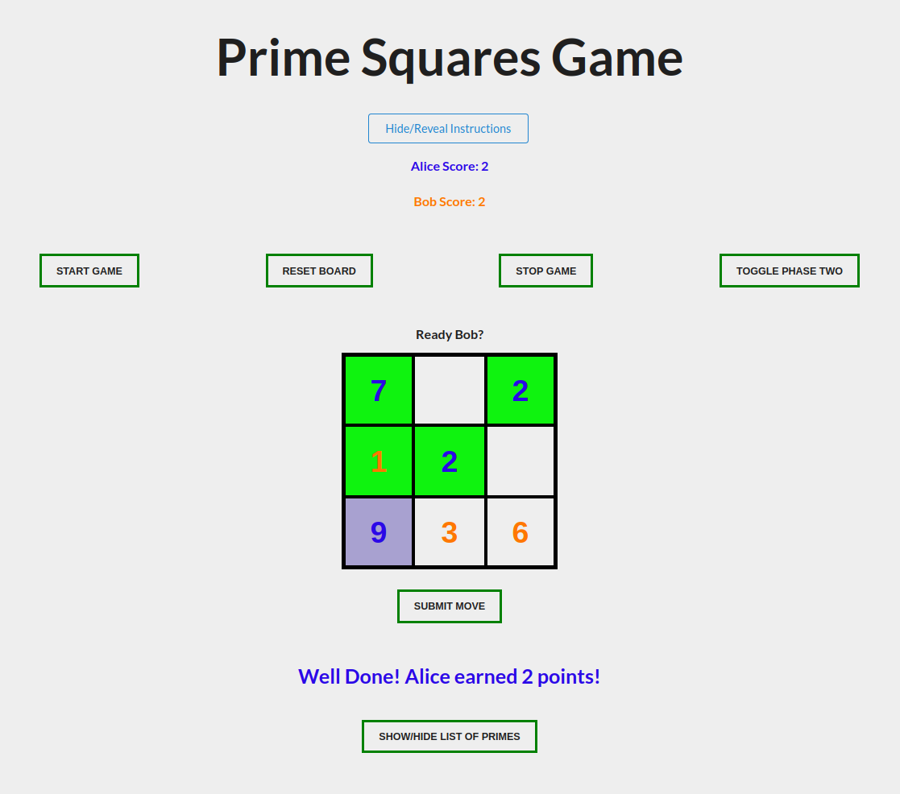

# PrimeSquaresGame

Final project for NYU Heuristic Problem Solving Fall 2022.

The game can played on [Dr. Ecco's Website](https://cims.nyu.edu/drecco2016/games/Prime_Squares/)
You can find the slides for how the game works and [some design ideas](about/PrimeSquaresGame.pdf).

## Gameplay Screenshot

## Teammates

Anav Prasad ([vrangr1](https://github.com/vrangr1)), Kumar Prasun ([TestSubjector](https://github.com/TestSubjector))
